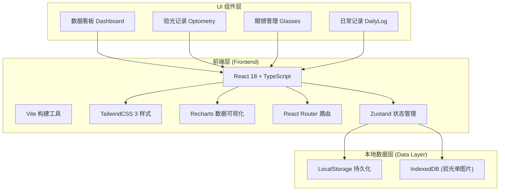
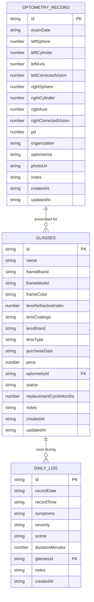

## 1. 架构设计



## 2. 技术描述

- **前端框架**：React@18 + TypeScript@5
- **构建工具**：Vite@5
- **样式方案**：TailwindCSS@3 + PostCSS + Autoprefixer
- **数据可视化**：Recharts@2（折线图、散点图、饼图、环形进度图）
- **路由管理**：React Router@6
- **状态管理**：Zustand@4（轻量级状态管理，支持持久化）
- **图标库**：Lucide React（线性简约图标）
- **后端服务**：无（纯前端应用，数据本地持久化）
- **数据存储**：LocalStorage（结构化数据） + IndexedDB（图片文件）
- **Mock 数据**：内置示例数据，首次启动自动生成

## 3. 路由定义

| 路由 | 页面组件 | 用途 |
|------|----------|------|
| `/` | Dashboard | 数据看板 - 总览当前度数、趋势速览、镜片状态、提醒事项 |
| `/optometry` | OptometryList | 验光记录列表 |
| `/optometry/new` | OptometryForm | 新增验光记录 |
| `/optometry/:id` | OptometryDetail | 验光记录详情与编辑 |
| `/optometry/charts` | OptometryCharts | 度数趋势与散光变化图表 |
| `/glasses` | GlassesList | 眼镜管理列表 |
| `/glasses/new` | GlassesForm | 新增眼镜档案 |
| `/glasses/:id` | GlassesDetail | 眼镜详情与编辑 |
| `/daily` | DailyLogList | 日常症状记录列表 |
| `/daily/new` | DailyLogForm | 新增日常记录 |
| `/daily/analysis` | DailyLogAnalysis | 症状关联分析 |

## 4. 数据类型定义

```typescript
// 眼睛数据
interface EyeData {
  sphere: number;       // 球镜度数（近视负/远视正）
  cylinder: number;     // 柱镜度数（散光）
  axis: number;         // 轴位（0-180）
  correctedVision: number; // 矫正视力（如 1.0, 0.8）
}

// 验光记录
interface OptometryRecord {
  id: string;
  examDate: string;           // 验光日期 YYYY-MM-DD
  leftEye: EyeData;           // 左眼数据
  rightEye: EyeData;          // 右眼数据
  pd: number;                 // 瞳距 (mm)
  organization: string;       // 验光机构
  optometrist?: string;       // 验光师
  photoUrl?: string;          // 验光单照片 (IndexedDB URL)
  notes?: string;             // 备注
  createdAt: string;
  updatedAt: string;
}

// 镜片信息
interface LensInfo {
  refractiveIndex: number;    // 折射率 (1.56, 1.61, 1.67, 1.74)
  coatings: string[];         // 功能膜层 (防蓝光/防紫外线/抗疲劳/变色等)
  brand?: string;             // 镜片品牌
  type?: string;              // 镜片类型 (单光/渐进/双光等)
}

// 眼镜档案
interface Glasses {
  id: string;
  name: string;               // 眼镜昵称（如"日常佩戴"、"办公用"）
  frameBrand?: string;        // 镜架品牌
  frameModel?: string;        // 镜架型号
  frameColor?: string;        // 镜架颜色
  lens: LensInfo;             // 镜片信息
  purchaseDate: string;       // 配镜日期 YYYY-MM-DD
  price?: number;             // 价格
  optometryId?: string;       // 关联的验光记录ID
  status: 'active' | 'standby' | 'retired'; // 使用状态
  replacementCycleMonths: number; // 建议更换周期（月）
  notes?: string;
  createdAt: string;
  updatedAt: string;
}

// 症状类型
type SymptomType = 'eye_strain' | 'dryness' | 'dizziness' | 'blurred_vision' | 'headache' | 'tearing' | 'itching' | 'other';

// 用眼场景
type UsageScene = 'screen_work' | 'reading' | 'driving' | 'outdoor' | 'night_use' | 'gaming' | 'social' | 'other';

// 严重程度
type SeverityLevel = 'mild' | 'moderate' | 'severe';

// 日常症状记录
interface DailyLog {
  id: string;
  recordDate: string;         // 记录日期 YYYY-MM-DD
  recordTime?: string;        // 记录时间 HH:mm
  symptoms: SymptomType[];    // 症状类型
  severity: SeverityLevel;    // 严重程度
  scene: UsageScene;          // 发生场景
  durationMinutes?: number;   // 持续时长（分钟）
  glassesId?: string;         // 佩戴的眼镜ID
  notes?: string;             // 备注
  createdAt: string;
}

// 应用设置
interface AppSettings {
  recommendedCheckupIntervalMonths: number; // 建议复查间隔（月）
  notificationsEnabled: boolean;
  theme: 'light' | 'dark';
}
```

## 5. 数据模型 ER 图



## 6. 项目目录结构

```
/
├── .trae/
│   └── documents/
│       ├── PRD.md
│       └── ARCHITECTURE.md
├── public/
│   └── favicon.ico
├── src/
│   ├── components/          # 通用UI组件
│   │   ├── layout/         # 布局组件 (Sidebar, Header, Layout)
│   │   ├── charts/         # 图表组件 (LineChart, ScatterChart, RingProgress)
│   │   ├── forms/          # 表单组件 (DatePicker, NumberInput, FileUpload)
│   │   └── ui/             # 基础UI (Card, Button, Modal, Badge, Toast)
│   ├── pages/              # 页面组件
│   │   ├── Dashboard/
│   │   ├── Optometry/
│   │   ├── Glasses/
│   │   └── DailyLog/
│   ├── store/              # Zustand 状态管理
│   │   ├── optometryStore.ts
│   │   ├── glassesStore.ts
│   │   ├── dailyLogStore.ts
│   │   └── settingsStore.ts
│   ├── types/              # TypeScript 类型定义
│   │   └── index.ts
│   ├── utils/              # 工具函数
│   │   ├── dateUtils.ts
│   │   ├── visionUtils.ts
│   │   └── storage.ts
│   ├── data/               # Mock 数据
│   │   └── mockData.ts
│   ├── hooks/              # 自定义 Hooks
│   │   ├── useReminders.ts
│   │   └── useChartData.ts
│   ├── styles/             # 全局样式
│   │   └── index.css
│   ├── App.tsx
│   ├── main.tsx
│   └── vite-env.d.ts
├── index.html
├── package.json
├── tsconfig.json
├── tsconfig.node.json
├── vite.config.ts
├── tailwind.config.js
└── postcss.config.js
```
