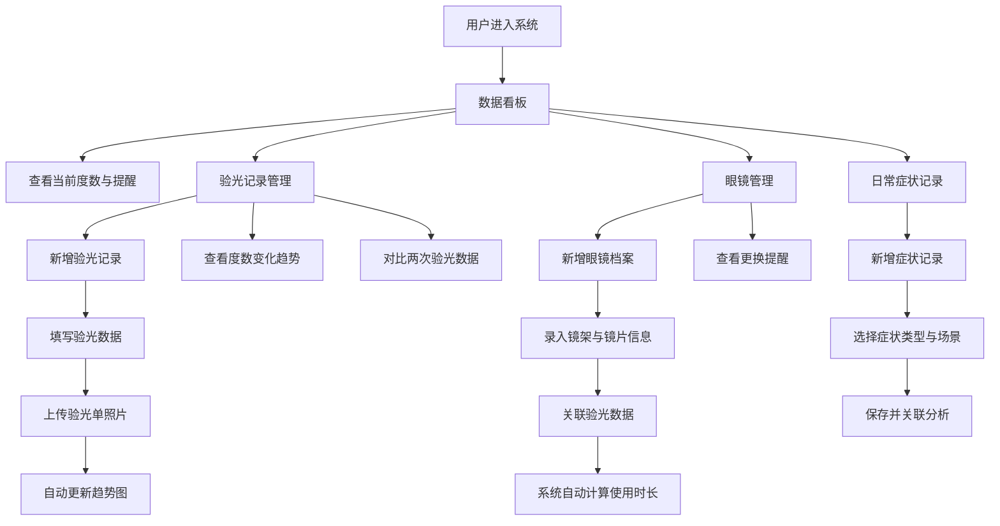

## 1. 产品概述

个人眼镜度数变化记录与镜片更换管理系统，面向近视、远视、散光用户，提供验光数据长期追踪、多副眼镜更换管理、用眼习惯关联分析的一体化解决方案。帮助用户科学管理视力健康，及时发现度数异常变化，合理安排镜片更换周期。

---

## 2. 核心功能

### 2.1 用户角色

| 角色 | 注册方式 | 核心权限 |
|------|----------|----------|
| 普通用户 | 本地存储，无需注册 | 完整使用所有功能，数据本地持久化 |

### 2.2 功能模块

1. **数据看板**：当前度数概览、历史变化趋势、镜片使用天数、下次建议验光日期提醒
2. **验光记录**：验光数据录入、验光单照片上传、度数变化趋势折线图、散光变化散点图、时间范围对比
3. **眼镜管理**：眼镜档案管理、镜片使用时长计算、更换周期提醒、关联验光数据
4. **日常记录**：佩戴不适症状记录、用眼场景标注、症状与度数变化关联分析

### 2.3 页面详情

| 页面名称 | 模块名称 | 功能描述 |
|----------|----------|----------|
| 数据看板 | 度数概览卡片 | 展示左右眼最新球镜、柱镜、轴位、瞳距、矫正视力 |
| 数据看板 | 趋势速览图表 | 最近6次验光度数变化迷你折线图 |
| 数据看板 | 镜片状态卡片 | 每副眼镜使用天数、剩余更换周期进度条、下次验光倒计时 |
| 数据看板 | 提醒事项 | 复查提醒、镜片更换提醒、异常变化预警 |
| 验光记录 | 记录列表 | 按时间倒序展示所有验光记录，支持筛选与搜索 |
| 验光记录 | 新增/编辑表单 | 录入验光日期、左右眼数据、验光机构、上传验光单照片 |
| 验光记录 | 度数趋势图 | 双眼球镜度数变化折线图，支持时间范围选择 |
| 验光记录 | 散光变化图 | 柱镜度数与轴位散点图，可视化散光演变 |
| 验光记录 | 对比分析 | 选择两次验光记录，对比视力变化幅度 |
| 眼镜管理 | 眼镜列表 | 展示所有眼镜卡片，包含品牌型号、镜片信息、使用状态 |
| 眼镜管理 | 新增/编辑表单 | 录入镜架品牌型号、镜片折射率与膜层、配镜日期与价格、关联验光单 |
| 眼镜管理 | 使用时长统计 | 自动计算佩戴天数、距离建议更换周期的剩余时间 |
| 眼镜管理 | 更换提醒配置 | 设置镜片更换周期（如6个月/12个月），临近时自动提醒 |
| 日常记录 | 症状记录列表 | 按时间展示眼部不适记录，含症状类型、严重程度、发生场景 |
| 日常记录 | 新增/编辑表单 | 选择症状（眼疲劳/干涩/眩晕/视物模糊等）、标注场景（长时间屏幕/驾车/阅读等） |
| 日常记录 | 关联分析 | 症状高发时段与度数变化节点的关联可视化 |

---

## 3. 核心流程

---

## 4. 用户界面设计

### 4.1 设计风格

- **主色调**：深海蓝 `#1e3a5f` 搭配 薄荷绿 `#2dd4bf`，传达医疗健康的专业感与清新感
- **辅助色**：暖橙色 `#fb923c` 用于提醒与强调，柔和灰 `#f1f5f9` 用于背景分层
- **按钮风格**：圆角胶囊按钮，主要按钮渐变填充，次要按钮描边，悬停微缩放动效
- **字体**：标题使用 Noto Serif SC（衬线体，专业典雅），正文使用 Noto Sans SC（无衬线，清晰易读）
- **布局风格**：卡片式布局，左侧导航栏 + 顶部状态栏 + 主内容区，玻璃态（Glassmorphism）卡片效果
- **图标风格**：线性简约图标，统一 2px 描边，搭配柔和的品牌色点缀

### 4.2 页面设计概述

| 页面名称 | 模块名称 | UI 元素 |
|----------|----------|----------|
| 数据看板 | 度数概览卡片 | 左右眼分栏展示，大号数值展示度数，渐变背景，微弹入动画 |
| 数据看板 | 迷你趋势图 | 内嵌 SVG 折线图，数据点悬停显示详情，淡入动画 |
| 数据看板 | 镜片进度条 | 彩色渐变进度条，剩余时间以不同颜色区分（绿/黄/红） |
| 数据看板 | 提醒时间轴 | 纵向时间轴设计，重要提醒闪烁标记 |
| 验光记录 | 记录表 | 斑马纹表格，验光单缩略图预览，行悬停高亮 |
| 验光记录 | 图表区 | 双折线图对比左右眼，散点图用颜色区分左右眼，图例可切换 |
| 眼镜管理 | 眼镜卡片 | 横向卡片布局，眼镜示意图标，状态标签（使用中/备用/已更换） |
| 眼镜管理 | 使用时长环 | 环形进度条展示更换周期完成度，中心显示使用天数 |
| 日常记录 | 症状标签云 | 症状类型以彩色标签形式展示，点击筛选 |
| 日常记录 | 场景时间轴 | 横向时间轴展示不同场景下的症状发生频率 |

### 4.3 响应式设计

- 桌面端优先，采用 1440px 基准栅格系统
- 平板端（768px-1024px）：左侧导航收起为图标栏，卡片两列排布
- 移动端（<768px）：顶部汉堡菜单导航，卡片单列排布，图表自适应缩放

---
